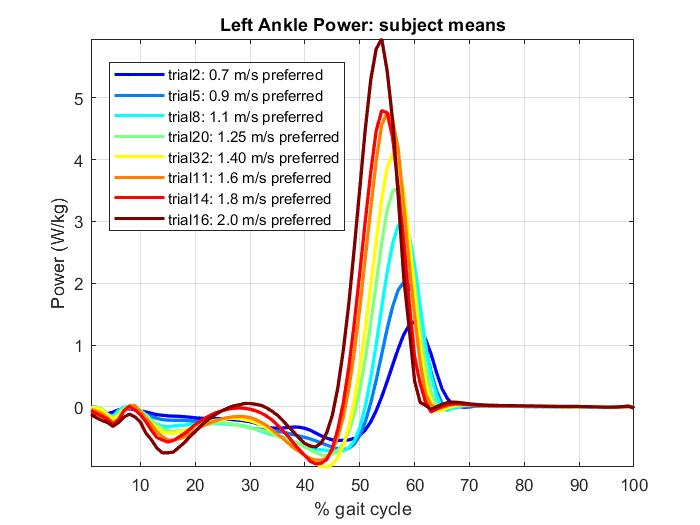
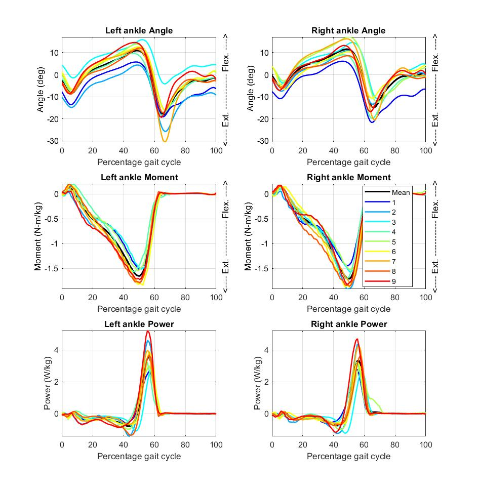
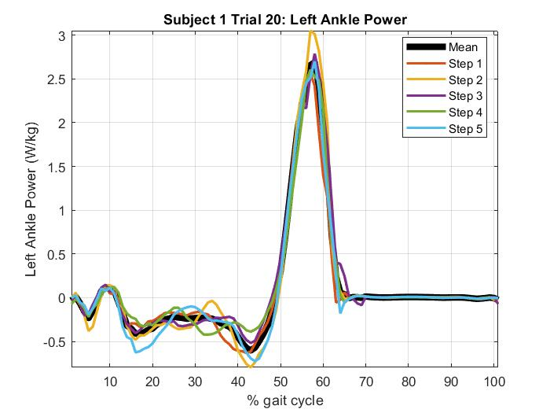
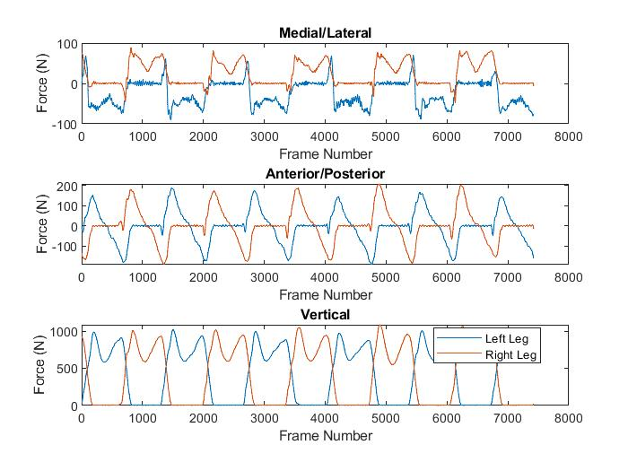

# Visualization #

Once 5 strides of good quality data have been selected, they can be visualized using the example_plotting.m script. 

The script allows the user to choose:
 * Variable of interest (such as moment, power, angle)
 * Leg (left or right)
 * Joint (ankle, knee or hip)
 * Type of experiment (for example preferred walking)

Once these have been selected, the script allows the user to select a certain subject and participant to look at in particular.
The following figures are created if we choose to look at subject 1 for trial 20 in the sagittal plane.

## Figures 1 and 2: all participants ##

## Figures 3-5: only the selected participant ##

